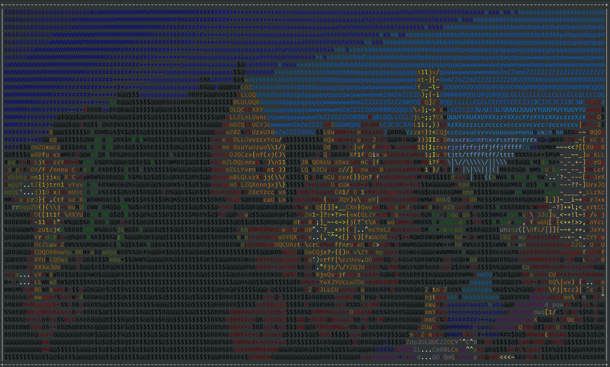

This python script print an image in a xterm 256 terminal. The image size will be adapted with the terminal size. It will be centered and surrounded with a box.

Example :




Do not expect perfect results for complex images :wink:.

You only need the Pillow Module, tested with Python3.8.

Any contribution is well accepted (code, documentation, ideas, issues, ...) !

I code it a bit fast so please excuse the typos and the code design

Usage :
```bash
python3 main.py my-picture.png
```
